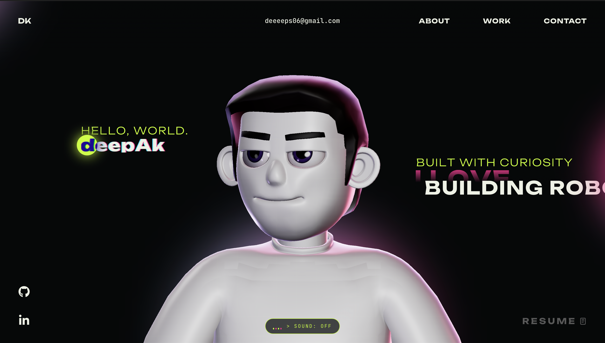

<div align="center">

```
 ____  _____ _____ ____    _    _
|  _ \| ____| ____|  _ \  / \  | | __
| | | |  _| |  _| | |_) |/ _ \ | |/ /
| |_| | |___| |___|  __// ___ \|   <
|____/|_____|_____|_|  /_/   \_\_|\_\
```

### `PLAYER 1 / BUILDER 1`

**A retro-arcade portfolio for a robotics and embedded builder.**
Press start. Scroll down. Meet the bots.

[](https://deepxk.vercel.app)
[](./LICENSE)




</div>

---

## 🕹️ What is this?

The personal site of **Deepak**, an EEE student who builds robots. It looks
like an arcade cabinet, but underneath it is an engineering log: autonomous
navigation, SLAM, embedded systems and custom hardware.

## 🎮 Level select

| Level | What's inside |
| --- | --- |
| **LOADER** | Lime "PLAYER 1 / BUILDER 1" marquee and a handheld console playing a **real, live Pong match** |
| **HERO** | 3D animated character, "HELLO, WORLD. deepAk", lime / pink / white tagline, socials, resume link, custom cursor |
| **ABOUT** | Full story on laptop and tablet, a shorter cut on phones, with a scan-line, blur and glitch reveal on mobile |
| **WHAT I DO** | Robotics & Autonomy, and Embedded & Vision |
| **CAREER** | Timeline from pre-university college to the embedded systems club |
| **WORK** | Six featured projects, plus a full `/myworks` page |
| **TECH STACK** | Interactive 3D section you can play with |
| **CONTACT** | Working email form, BOT.EXE mini-game and the live listening card |

## 🤖 Boss fights (projects)

- **Branchless**
- **Hexapod-6**
- **SLAM robot**
- **ROS 2 MPC navigation system**
- **Soil grain system**
- **Motor control PCB**

Full write-ups live on the [`/myworks`](https://deepxk.vercel.app/myworks) page.

## 🎧 Easter eggs and extras

- 🔊 **SOUND toggle:** background music (`theme.mp3`)
- 🎵 **"Deepak is listening to":** a live card powered by Last.fm, which scrobbles my Spotify plays. It has a tap-to-play 30-second preview fetched from iTunes or Deezer. It stays silent until tapped and takes turns with the SOUND button, so the two never overlap
- 👾 **BOT.EXE:** a retro mini-game next to the contact form (desktop only)
- 🏓 **Pong loader:** shrunk to fit phones
- 📬 **Link previews:** shares cleanly on LinkedIn, WhatsApp and X
- 📱 **Mobile-first details:** centred CTA buttons, tuned hero text, shorter About copy

## 🎶 How the listening card works

```
Spotify  →  Last.fm (scrobbles)  →  site reads recent track  →  iTunes / Deezer (30s preview)
```

The site never talks to Spotify directly. Spotify scrobbles every play to
Last.fm, the card reads the latest track from Last.fm, and the preview clip
comes from iTunes or Deezer.

## 🛠️ Tech

| Layer | Tools |
| --- | --- |
| Frontend | React, TypeScript, Three.js |
| Backend | Vercel serverless functions |
| Email | Resend |
| Music | Last.fm API (Spotify scrobbles), iTunes / Deezer for 30-second previews |
| Hosting | Vercel |

## 🚀 Insert coin (run locally)

```bash
git clone https://github.com/Deepakk-06/personal-portfolio.git
cd personal-portfolio
npm install
npm run dev
```

The contact form (Resend) and the listening card (Last.fm) need API keys.
Without them the site still runs, but those two features won't work.
Never commit real keys: keep them in a local `.env` file and in your host's
environment variable settings.

## 🗺️ Roadmap

- [x] Pong loading screen
- [x] Last.fm listening card with previews
- [x] Mobile About reveal
- [x] Link previews for LinkedIn and WhatsApp
- [ ] About: VLA / Isaac Lab research and SO-101 build
- [ ] "Off the clock" section
- [ ] Live YouTube sync

## 🙌 Credits

This project started from the open-source portfolio of
[Redoyanul Haque](https://www.redoyanulhaque.me) (MIT License). The design,
visuals, interactions and content have since been rebuilt and rewritten.
Thanks to Redoyanul for the starting point.

## 📄 License

Released under the [MIT License](./LICENSE).
Copyright (c) 2025 Redoyanul Haque · Copyright (c) 2026 Deepak

<div align="center">

**GAME OVER? NEVER. INSERT COIN TO CONTINUE.**

</div>
